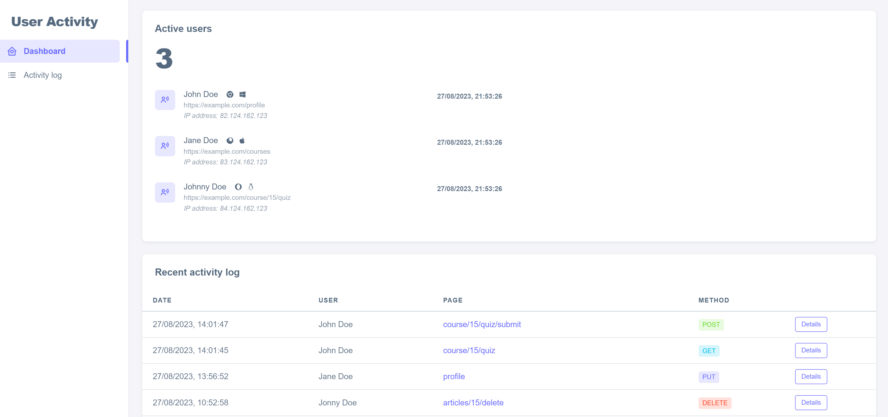

# Laravel user activity and tracking
This package provides real-time tracking of active users on your website and logs their activity. It can be installed on any Laravel project version 9 or 10.

The real-time tracking is powered by websockets, so you will need to set up a Pusher account. Alternatively, laravel-websocket can also be used.



-----

## Requirement
- PHP 8.1+
- Laravel 9|10
- Pusher (For real-time tracking)

-----

## Installing
Install this package through composer:

```bash
composer require allenkhoury/user-activity
```

Once installed, it will be auto discovered by laravel.

Next, we need to publish the necessary data for this package: migrations, config and assets.
- migrations: tables required to log user activity.
- config: a set of options to tweak the plugin.
- assets: these are required to load the user activity dashboard panel.

Run the code below to publish all package necessary data:
```bash
php artisan vendor:publish --tag=al-user-activity.package
```

We can then run migrate to create the package's tables in the database.

```bash
php artisan migrate
```

-----

## Real time tracking
This package provides real-time tracking of active users on your website using websockets. Pusher is the preferred websockets provider for this package.

**Installing Pusher**

To install Pusher, you can follow the instructions in the [Laravel broadcasting documentation](https://laravel.com/docs/8.x/broadcasting#pusher-channels).

**Adding the tracking script to your layout file**

Once you have installed Pusher, you need to add the following code to your layout blade file, at the bottom of the file after scripts:
```php
@tracking_script
```
This custom blade directive will inject some scripts in your layout file so Laravel Echo can start tracking properly.

**Enabling real-time tracking**

Finally, you need to enable real-time tracking by setting the following environment variable:
```
AL_TRACKING_ENABLED=true
```

**Setting the user identifier**

The package needs to know which column in your database contains the user's name. By default, the package assumes that the column is called `name`. However, you can change this by setting the user_identifier option in the package configuration file.

-----

## Activity log
This package can also log user activity on the website. This can be useful for tracking how users are interacting with your website and identifying potential problems.

**Enabling activity logging**

To enable activity logging, you need to set the following environment variable to `true`:
```
AL_ACTIVITY_LOG_ENABLED=true
```

**Configuration**

By default, this package will track the following HTTP requests:
- POST
- PUT
- PATCH
- DELETE

However, you can change this configuration by editing the `allowed_methods` option in the package's published configuration file. For example, to only track POST and PUT requests, you would change the configuration to the following:
```php
'activity_log' => [
    'enabled' => env('AL_ACTIVITY_LOG_ENABLED', false),
    'allowed_methods' => [
        'POST', 'PUT'
    ],
]
```

You can check the supported HTTP methods in the [Laravel route documentation](https://laravel.com/docs/10.x/routing#available-router-methods)

**Exceptions**

You can exclude some routes from being tracked by adding the `no-logging` middleware to your routes.

**Note**: This package will only log activity of **authenticated** users. Guests will not be tracked.

-----

## Dashboard
The package comes with a dashboard that allows you to track active users and check all activity logs.

**Enabling the dashboard**

The dashboard is enabled by default. To disable it, set the following environment variable to `false`:
```
AL_DASHBOARD_ENABLED=false
```

**Dashboard URL**

The dashboard is available on the URL `/al-user-activity`. You can change the URL by adding a prefix using the option `url_prefix` in the package configuration file. For example, to add the prefix admin (/admin/al-user-activity), you would change `url_prefix` as follows:
```php
'dashboard' => [
    'enabled' => env('AL_DASHBOARD_ENABLED', true),
    'url_prefix' => 'admin',
    'extra_middlewares' => [],
],
```

**Dashboard access**

By default, any authenticated user can access the dashboard. To restrict access, for example to just admins, you can add your custom middleware alias to the option `extra_middleware`s in the package configuration file. For example:
```php
'dashboard' => [
    'enabled' => env('AL_DASHBOARD_ENABLED', true),
    'url_prefix' => 'admin',
    'extra_middlewares' => ['admin-middleware-alias'],
],
```

_Note: You can add as many middlewares as needed._

-----

## General notes

The package will use the model set in `config('auth.provider.users.model')` as the users model.

The dashboard UI is built using the free template [Sneat](https://themeselection.com/item/sneat-free-bootstrap-html-admin-template/) by [ThemeSelection](https://themeselection.com/)

-----

## License
The MIT License (MIT). Please see [License File](https://github.com/.../blob/master/LICENSE.md) for more information.
